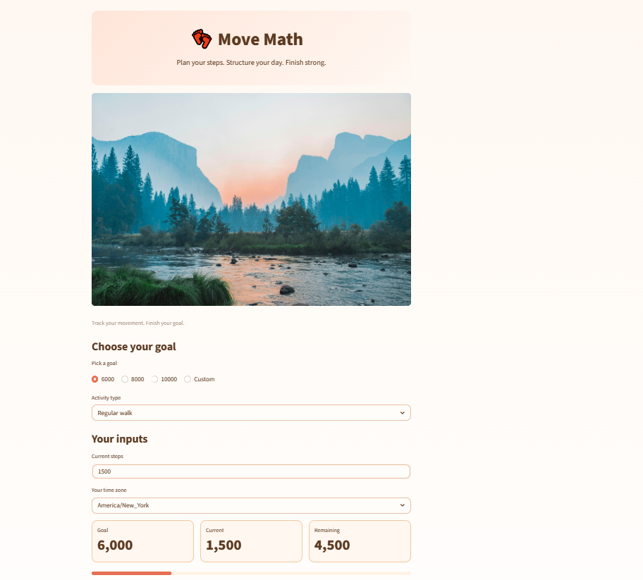
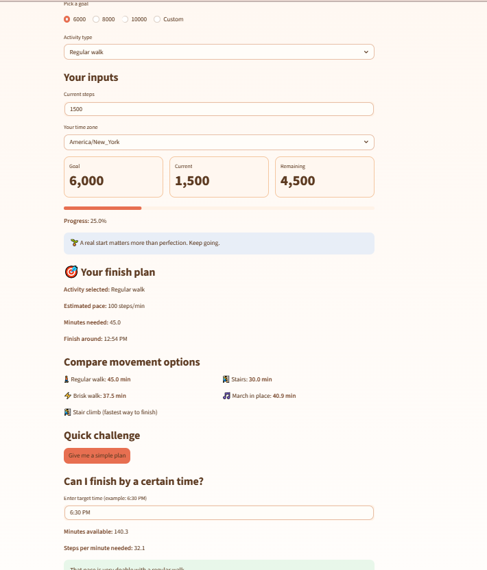
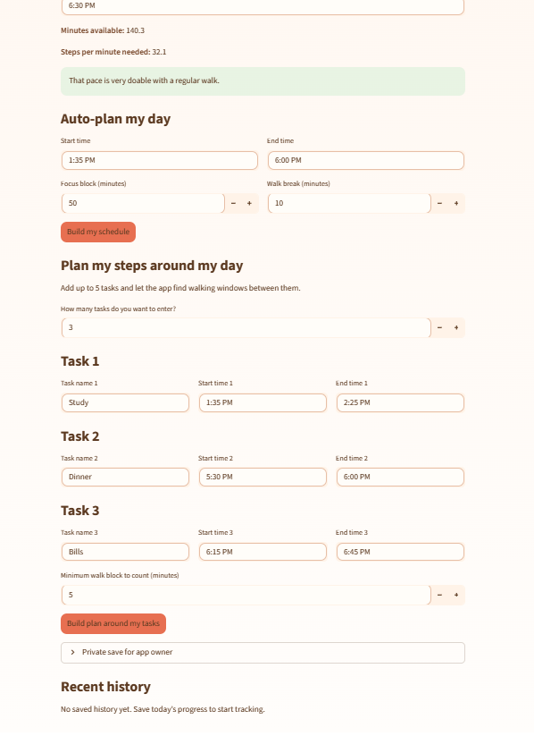

# MoveMath: Data-Driven Step Planning App

MoveMath is a Streamlit-based application that helps users plan and track daily step goals using data-driven insights. It calculates how long it will take to reach a step goal based on activity level and visualizes progress over time.

## Features
- Calculates time needed to reach step goals
- Supports different activity paces (walking, brisk, stairs, custom)
- Tracks daily progress
- Visualizes step history with charts
- Helps users plan movement alongside daily tasks

## Screenshots





## 🛠 Tools Used
- Python (data processing and logic)
- Pandas (data manipulation)
- Streamlit (interactive application)
- Altair (data visualization)

## Project Purpose
This project demonstrates how data can be used to support everyday decision-making, improve consistency, and make personal health tracking more actionable.

## ▶️ How to Run
1. Clone the repository  
2. Install dependencies  
3. Run the app:

```bash
streamlit run step_app.py
